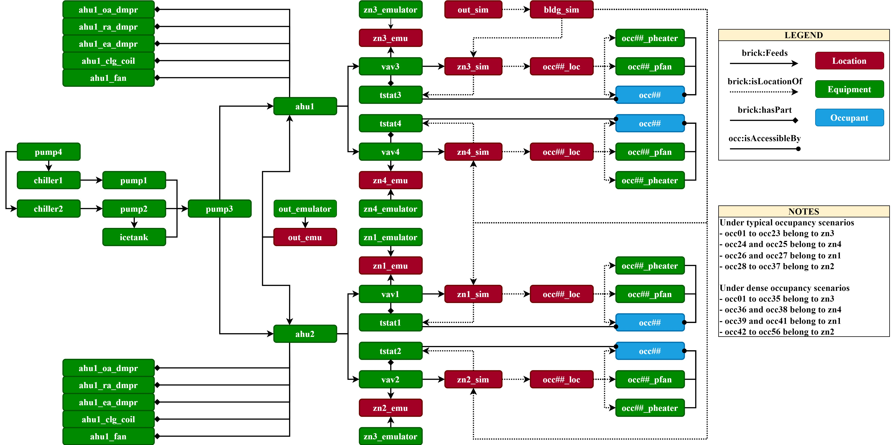
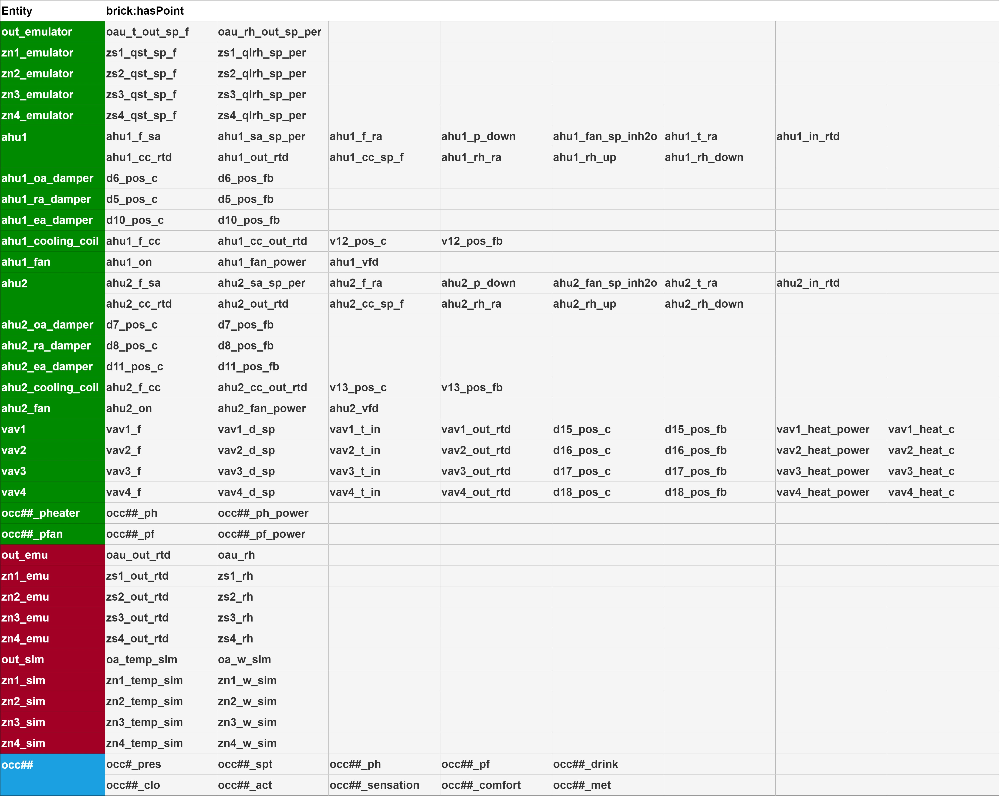
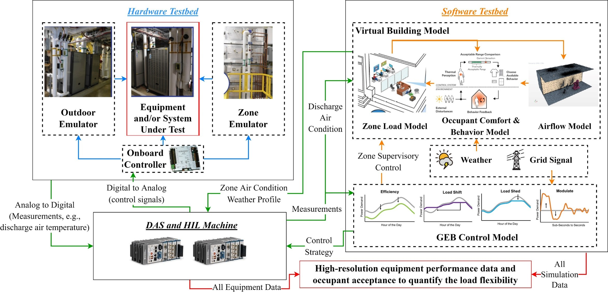
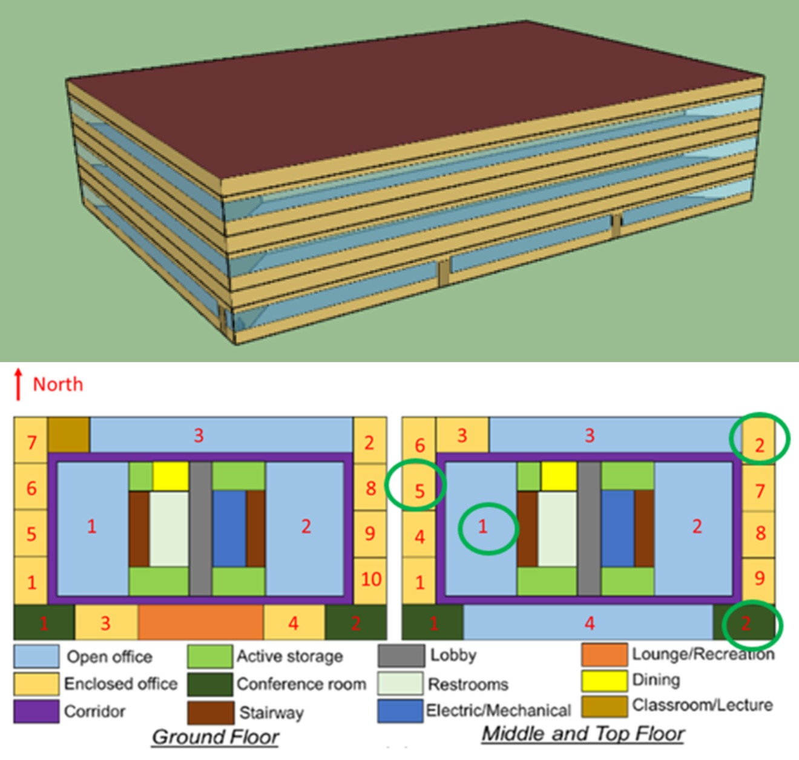
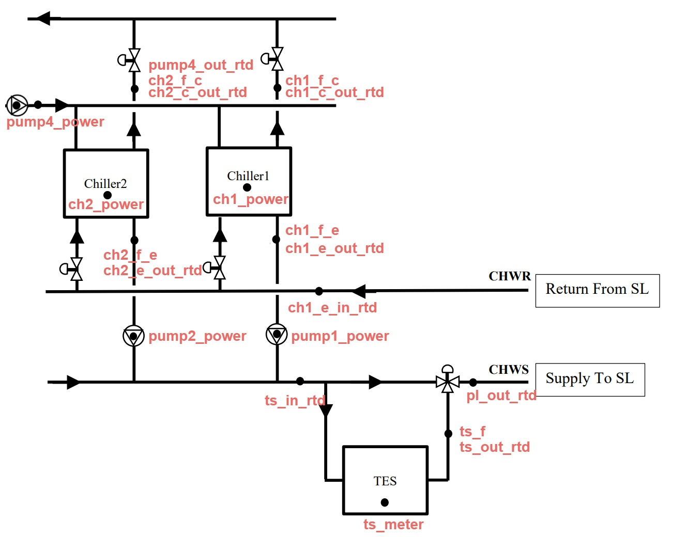
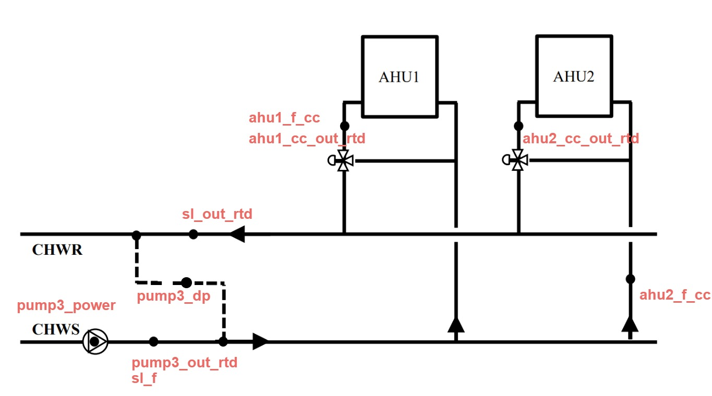
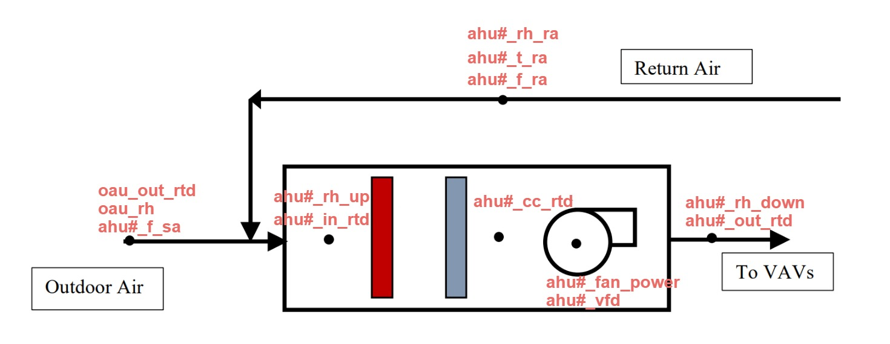
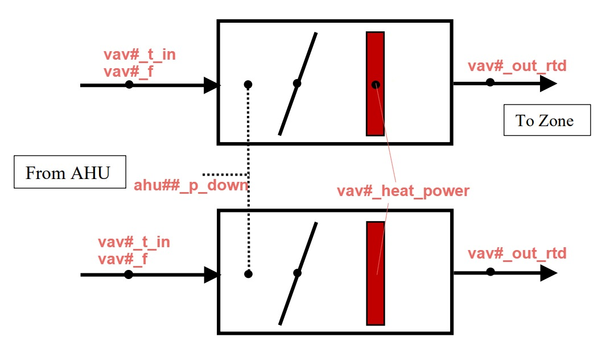
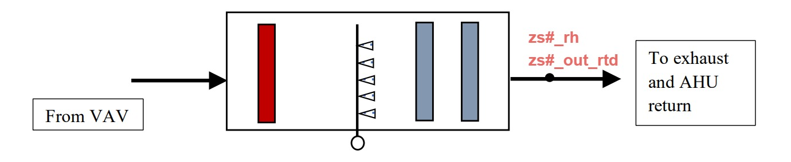

> **Note**: 
>
> For better readability of this document, it is recommended to use a Markdown viewer or tool.
>
> **Disclaimer**: 
> 
> The information contained in this document is for general information purposes only. While we strive to keep the information up to date and correct, we make no representations or warranties of any kind, express or implied, about the completeness, accuracy, reliability, suitability, or availability with respect to the content provided. Any reliance you place on such information is strictly at your own risk.
> 
> Certain commercial entities, equipment, or materials may be identified in this document in order to describe an experimental procedure or concept adequately. Such identification is not intended to imply recommendation or endorsement by the National Institute of Standards and Technology, nor is it intended to imply that the entities, materials, or equipment are necessarily the best available for the purpose.

## Table of Contents

Overview
- [Introduction](#introduction)
- [Repository Structure](#repository-structure)
- [Data Description](#data-description)
- [Data Schema](#data-schema)

Technical Details
- [Methodology](#methodology)
- [Software Testbed](#software-testbed)
- [Hardware Testbed](#hardware-testbed)
  - [System Configuration](#system-configuration)
- [Test Scenarios](#test-scenarios)

Additional Information
- [Contact Information](#contact-information)
- [Cite the Datasets](#cite-the-datasets)
- [References](#references)

## Introduction
This document provides comprehensive details of the datasets generated from the project titled, "Hardware-in-the-Loop Laboratory Performance Verification of Flexible Building Equipment in a Typical Commercial Building." This project is financially supported by the U.S. Department of Energy under grant number EE-0009153. These datasets are obtained from extensive hardware-in-the-loop (HIL) testing of the Intelligent Buildings Agents Laboratory (IBAL) at the National Institute of Standards and Technology (NIST), conducted under a diverse range of conditions and operational settings. 

## Repository Structure
**[data](data)** contains all datasets organized into three levels of subfolders:
- Level-1 (LOC: Atlanta, Buffalo, NewYork, Tucson): These folders present different locations where testing was performed.
- Level-2 (GEB: Eff, Shed, Shift, Mod): These folders present various operational scenarios for the IBAL.
- Level-3 (VAR: Default, DenOcc, EnergySave, etc.): These folders present specific test cases under the respective operational scenarios. These scenarios are further explained in [Test Scenarios](#test-scenarios). Each folder contains a `data.csv` file. For each Load Modulating (Mod) case, an additional file, `data_mod.csv`, which records the second-by-second power modulation performance, is included.

**[raw](raw)** contains all the raw datasets corresponding to each dataset in the [data](data) folder.

**[assets](assets)** contains related figures, metadata, and data schema.

## Data Description
Data point definitions can be found in [Metadata](assets/Metadata.csv).

## Data Schema
### Brick
See [assets/HIL_IBAL_Brick_v1-3-0.ttl](assets/brick/HIL_IBAL_Brick_v1-3-0.ttl) and [assets/HIL_IBAL_Brick_v1-3-0_DenseOcc.ttl](assets/brick/HIL_IBAL_Brick_v1-3-0_DenseOcc.ttl) for the Brick models that represent the data points and their relationships. Specifically, the `_DenseOcc` version is associated with the data tested under the dense occupancy `DenOcc` scenario. These models were validated against [Brick v1.3.0](assets/brick/Brick_v1-3-0.ttl) and its [occupancy extension](assets/brick/brick_occ_ext.ttl). The following figures show the data points relationships created within the Brick models.

### ASHRAE 223p
See [assets/223p/IBAL.ttl](assets/223p/IBAL.ttl) for the ASHRAE 223p model. Please note that the 223p standard has not been officially published and is subject to change in the future. For more infomation about the 223p standard, please refer to [https://open223.info/](https://open223.info/).

## Methodology
The datasets were generated using the IBAL Hardware-In-the-Loop Flexible load Testbed (i.e., IBAL HILFT). The figure below depicts the overall framework of a HILFT, which includes three parts: a virtual building model, a Grid-interactive Efficient Building (GEB) control model, and a hardware testbed. The virtual building model further includes a zone load model, an occupant comfort & behavior model, and an airflow model. More details about the development and integration of the HILFT can be found in [^1].

## Software Testbed
### Zone Load Model
The zone load model was adapted from the enhanced commercial prototype building models [^2]. The circled zones, **Conference Room Mid 2**, **Enclosed Office Mid 2**, **Enclosed Office Mid 5**, and **Open Office Mid 1** were selected for HIL study while other zones followed the default schedules of the prototype models, and were served by ideal load systems within EnergyPlus. 

### Occupant Behaviors and Airflow Simulation
The occupant behavior model was adapted from Langevin et al. [^3]. Indoor airflow simulation was used to enhance the simulation of the local ambient environment of each occupant agent in the model, using the approach documented in [^4].

## Hardware Testbed
### System Configuration
THe IBAL HILFT includes two chillers, one ice thermal storage tank, two air handeling units (AHUs), four variable air volume (VAV) units, one outdoor air emulator, and four zone emulators. The figures below depict the system configuration.

## Test Scenarios
This data repository includes real-time HIL IBAL testing data considering:
- Locations: Atlanta, Buffalo, New York, and Tucson; 
- Grid-interactive Efficient Building (GEB) scenarios: Efficiency (Eff), Load Shedding (Shed), Load Shifting (Shift), and Load Modulating (Mod); 
- Other variations: weather condition, control strategy, building type, occupancy, occupant behavior, and thermal energy storage (TES). 

The **Default** cases (i.e., the third column of the table) were tested with typical summer weather, using a rule-based control (RBC) strategy, with a typical building type, occupancy, and occupant behaviors, and without TES. Each subsequent column header points to the deviation from this default settings. Details regarding the test settings of these scenarios can be found in [IBAL_Test_Settings](assets/IBAL_Test_Settings.pdf).

| Location | GEB Scenario | Default | ExtrmSum | TypShldr | ExtrmWin | MPC | STD2019 | DenseOcc | EnergySave | TES | MPC&TES |
| ---      | ---          | ---     | ---      | ---      | ---      | --- | ---     | ---      | ---        | --- | ---     |
| Atlanta  | Eff          | x       | x        | x        |          | x   | x       | x        | x          |     |         |
|          | Shed         | x       | x        |          |          | x   | x       | x        | x          |     |         |
|          | Shift        | x       | x        |          |          | x   | x       | x        | x          | x   | x       |
|          | Mod          | x       | x        | x        |          | x   | x       | x        | x          |     |         |
| Buffalo  | Eff          | x       | x        | x        |          | x   | x       | x        | x          |     |         |
|          | Shed         | x       | x        |          |          | x   | x       | x        | x          |     |         |
|          | Shift        | x       | x        |          |          | x   | x       | x        | x          | x   | x       |
|          | Mod          | x       | x        | x        |          | x   | x       | x        | x          |     |         |
| New York | Eff          | x       | x        | x        |          | x   | x       | x        | x          |     |         |
|          | Shed         | x       | x        | x        |          | x   | x       | x        | x          |     |         |
|          | Shift        | x       | x        | x        |          | x   | x       | x        | x          | x   | x       |
|          | Mod          | x       | x        | x        |          | x   | x       | x        | x          |     |         |
| Tucson   | Eff          | x       | x        | x        |          | x   | x       | x        | x          |     |         |
|          | Shed         | x       | x        | x        |          | x   | x       | x        | x          |     |         |
|          | Shift        | x       | x        | x        |          | x   | x       | x        | x          | x   | x       |
|          | Mod          | x       | x        | x        |          | x   | x       | x        | x          |     |         |

## Contact Information
For any additional questions, clarifications, or feedback, please reach out to:

- **Jin Wen, PhD**: 
  - **Email**: jw325@drexel.edu

- **Amanda Pertzborn, PhD**:
  - **Email**: amanda.pertzborn@nist.gov

- **Zhelun Chen, PhD**: 
  - **Email**: zl.chen.career@gmail.com

## Cite the Datasets
Please cite the datasets as below:

*TBD*

## References
[^1]: Chen, Z., et al. "Development of a Hardware-in-the-loop Testbed for Laboratory Performance Verification of Flexible Building Equipment in Typical Commercial Buildings." ASHRAE Transactions 128 (2022). [[Link](https://arxiv.org/abs/2301.13412)]

[^2]: Pang, Z., et al. "Nationwide HVAC energy-saving
potential quantification for office buildings with occupant-centric controls in various climates." Applied Energy 279 (2020): 115727.

[^3]: Langevin, J., et al. "Simulating the human-building interaction: Development and validation of an agent-based model of office occupant behaviors." Building and Environment 88 (2015): 27-45. 

[^4]: Zhang, Y., et al.  "CFD-Trained ANN Model for Approximating Near-occupant Condition in Real-time Simulations." ASHRAE Topical Conference Proceedings. American Society of Heating, Refrigeration and Air Conditioning Engineers, Inc., 2022.
